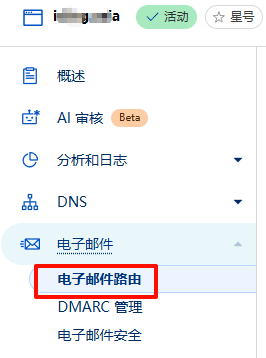
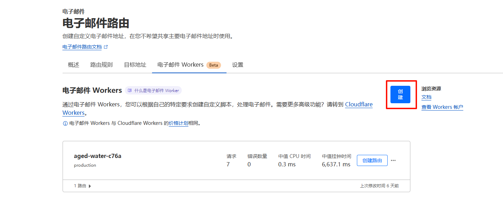
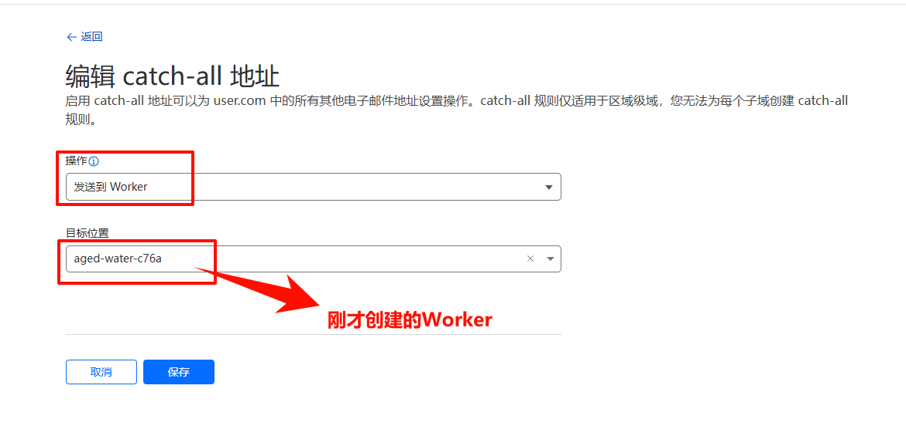

# Cloudflare邮件分类转发多个地址

Cloudflare提供了强大的电子邮件路由功能，可以根据收件人地址前缀将邮件智能分类并转发到不同的目标邮箱。本文将详细介绍如何设置和配置这一功能。

## 1. 配置电子邮件路由

### 1.1 进入域名下的「电子邮件路由」

首先登录您的Cloudflare账户，选择要配置的域名，然后在左侧导航栏中找到并点击「电子邮件路由」选项。



### 1.2 打开电子邮件 Worker 创建

在电子邮件路由页面中，找到并点击「创建电子邮件 Worker」按钮。这将允许您创建一个自定义的邮件处理逻辑。



将默认代码修改为以下模式：

```javascript
export default {
  async email(message, env, ctx) {
    // 1. 读取 Envelope To（收件人信封地址）
    const recipient = message.to; // Envelope To 属性
 
    // 2. 判断收件人地址是否以 "dcl" 开头（不区分大小写）
    if (recipient && recipient.toLowerCase().startsWith("dcl")) { 
      // 3. 转发到目标邮箱（必须是已在 Email Routing 中验证过的地址）
      //    使用 ctx.waitUntil 确保转发操作异步执行且不阻塞 Worker 结束
      ctx.waitUntil(message.forward("转发邮箱地址（XXX@XXX）")); 
    } else {
      // 不以"dcl"开头的转发到这，可以多个目标地址
      ctx.waitUntil(message.forward("转发的另外一个地址")); 
    }
  }
}
```

> 注意：上述代码中有一个语法错误已被修正（原代码中`if`语句的闭合大括号有误）

### 1.3 配置目标规则

完成代码编写后，进入目标规则标签，开启 Catch-All 功能（捕获所有邮件），然后点击编辑按钮进行配置。



## 2. 高级配置示例

### 2.1 多条件转发

如果您需要更复杂的转发规则，可以使用多个条件判断：

```javascript
export default {
  async email(message, env, ctx) {
    const recipient = message.to;
    
    if (recipient && recipient.toLowerCase().startsWith("dcl")) {
      ctx.waitUntil(message.forward("dcl专用邮箱@example.com"));
    } else if (recipient && recipient.toLowerCase().startsWith("tech")) {
      ctx.waitUntil(message.forward("技术部邮箱@example.com"));
    } else if (recipient && recipient.toLowerCase().startsWith("sales")) {
      ctx.waitUntil(message.forward("销售部邮箱@example.com"));
    } else {
      // 默认转发地址
      ctx.waitUntil(message.forward("通用邮箱@example.com"));
    }
  }
}
```

### 2.2 一对多转发

您也可以将同一封邮件转发到多个地址：

```javascript
export default {
  async email(message, env, ctx) {
    const recipient = message.to;
    
    if (recipient && recipient.toLowerCase().startsWith("team")) {
      // 同时转发到多个团队成员
      ctx.waitUntil(message.forward("团队成员1@example.com"));
      ctx.waitUntil(message.forward("团队成员2@example.com"));
      ctx.waitUntil(message.forward("团队成员3@example.com"));
    } else {
      ctx.waitUntil(message.forward("默认邮箱@example.com"));
    }
  }
}
```

## 3. 注意事项

1. 所有转发目标邮箱必须已在 Email Routing 中验证过
2. 确保您的代码语法正确，特别是条件判断语句的大括号匹配
3. 使用 `ctx.waitUntil()` 确保异步操作能够在 Worker 结束前完成
4. 邮件地址比较时建议使用 `toLowerCase()` 进行大小写不敏感的匹配

## 4. 总结

通过Cloudflare的电子邮件路由功能，您可以轻松实现邮件的智能分类和转发，提高邮件处理效率，让不同类型的邮件能够自动分发到相应的处理人手中。这对于管理多个业务线或团队的组织特别有用。

希望本教程对您有所帮助！如有任何问题，欢迎在评论区留言讨论。 