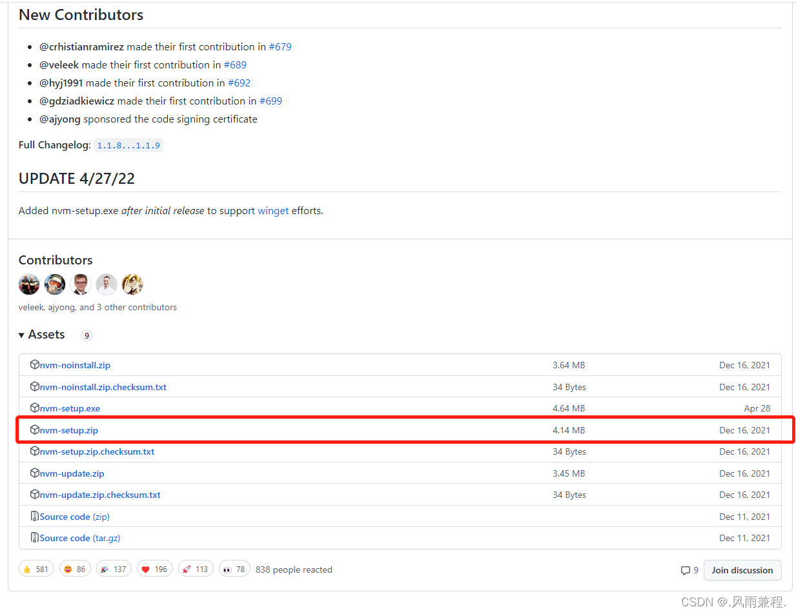
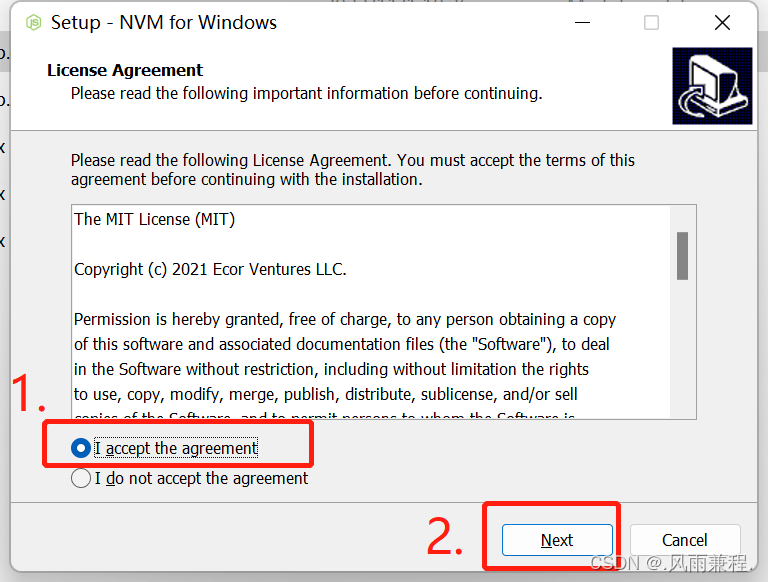
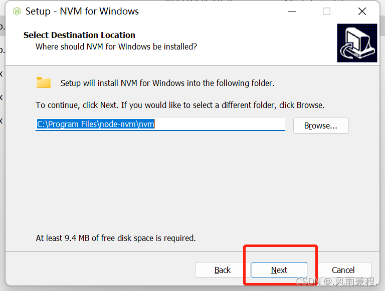
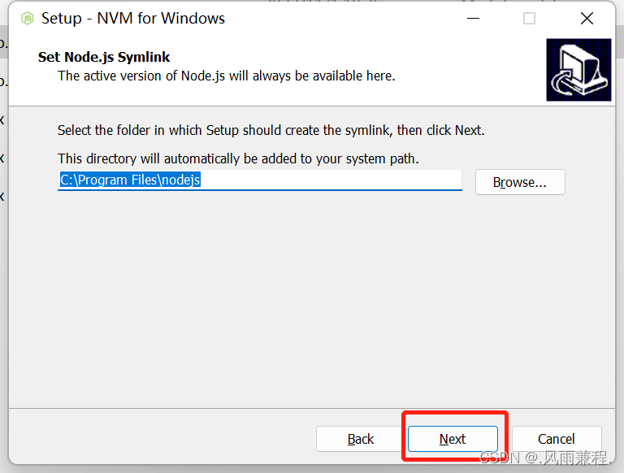
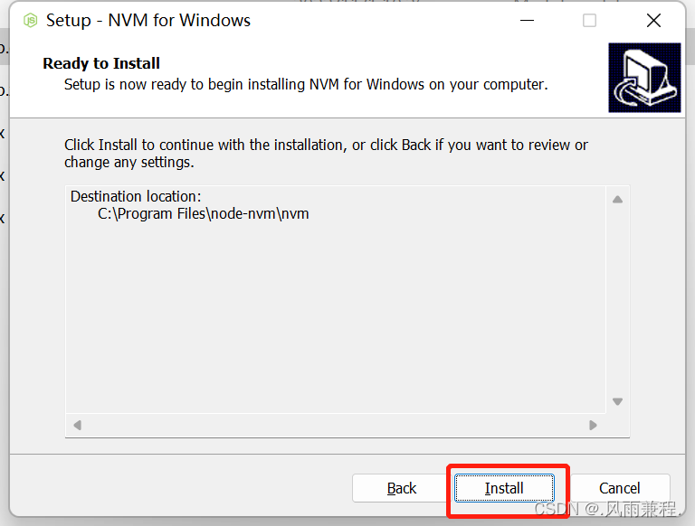
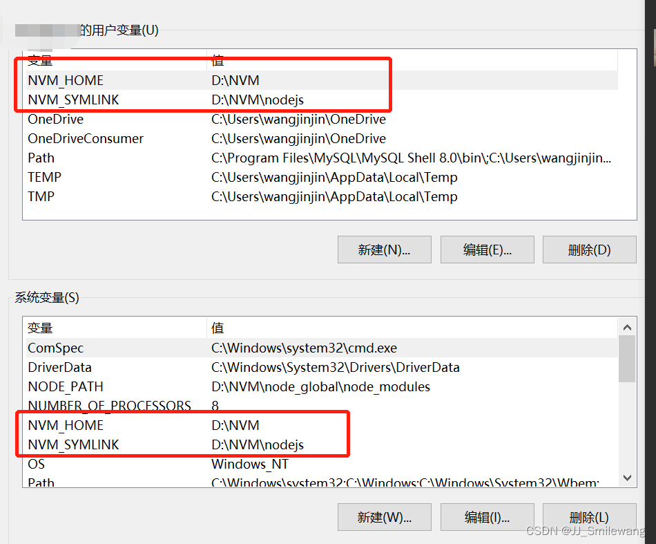
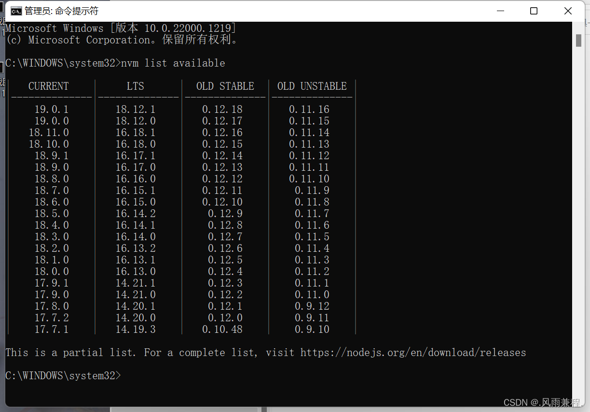
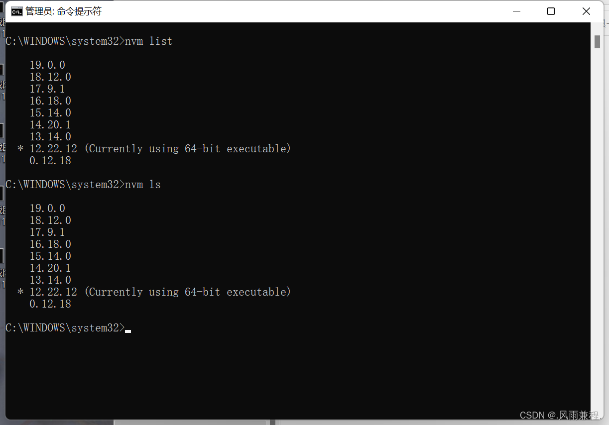
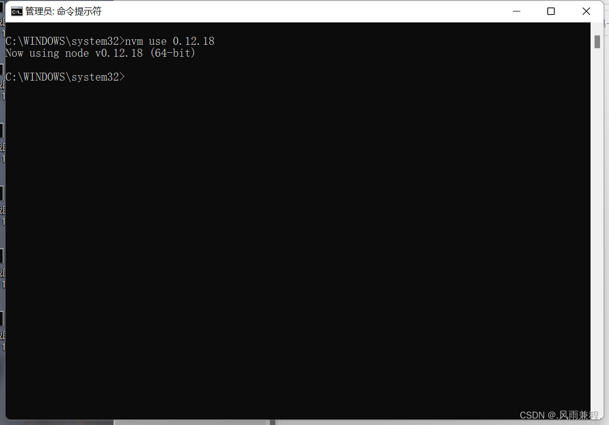

## NVM详细安装使用教程

NVM是一个Node.js的版本管理工具。通过它可以安装和切换不同版本的Node.js，解决各种版本存在不兼容现象的问题。

> 注意：此版本需要管理员权限，如需避免请查看新版本教程。

### 1. 卸载已有的Node.js

在安装NVM之前，需要先卸载系统中已有的Node.js（如果有的话）：

- 在控制面板或应用列表中卸载Node.js
- 如果上述方法不行，可以全局搜索并删除相关文件

**注意**：一定要确保Windows上没有Node.js残留，否则可能会影响NVM的正常使用。

### 2. 下载NVM

可以从以下地址下载NVM（任选其一）：

- [https://github.com/nvm-sh/nvm](https://github.com/nvm-sh/nvm)
- [https://github.com/coreybutler/nvm-windows/releases/tag/1.1.9](https://github.com/coreybutler/nvm-windows/releases/tag/1.1.9)
- [https://github.com/coreybutler/nvm-windows/releases](https://github.com/coreybutler/nvm-windows/releases)

推荐下载1.1.9版本，在Windows 11上测试有效。

### 3. 安装NVM

1. 选择同意协议

2. 选择NVM安装路径（建议使用默认路径）

3. 选择Node.js存储路径（建议使用默认路径）

4. 点击install，等待安装完成

### 检查环境变量

安装完成后，NVM会自动配置所需的环境变量。可以通过以下步骤检查环境变量是否正确设置：

1. 右键点击"此电脑"，选择"属性"
2. 点击"高级系统设置"
3. 在弹出窗口中点击"环境变量"按钮
4. 检查"用户变量"和"系统变量"中是否包含以下两项：
   - NVM_HOME：指向NVM的安装目录（如D:\NVM）
   - NVM_SYMLINK：指向Node.js的符号链接目录（如D:\NVM\nodejs）

正确设置环境变量后，才能在任何命令提示符窗口中使用NVM命令。

### 4. 安装Node.js

**重要提示**：一定要使用管理员身份运行命令提示符(cmd)

1. 输入 `nvm list available` 查看可安装的Node.js版本
   > 也可以去[Node.js官网](https://nodejs.org/)查看历史版本

2. 输入 `nvm install 版本号` 安装指定版本Node.js
   例如：`nvm install 14.17.0`

3. 输入 `nvm list` 或 `nvm ls` 查看已安装的Node.js版本

4. 输入 `nvm use 版本号` 切换使用指定版本的Node.js
   例如：`nvm use 14.17.0`

### 5. 常用NVM命令

| 命令 | 说明 |
| --- | --- |
| `nvm list` | 查看已经安装的版本 |
| `nvm list installed` | 查看已经安装的版本 |
| `nvm list available` | 查看网络可以安装的版本 |
| `nvm version` | 查看当前的版本 |
| `nvm install` | 安装最新版本Node.js |
| `nvm use <version>` | 切换使用指定的版本 |
| `nvm current` | 显示当前版本 |
| `nvm alias <name> <version>` | 给不同的版本号添加别名 |
| `nvm unalias <name>` | 删除已定义的别名 |
| `nvm reinstall-packages <version>` | 在当前版本环境下，重新全局安装指定版本号的npm包 |
| `nvm on` | 打开Node.js控制 |
| `nvm off` | 关闭Node.js控制 |
| `nvm proxy` | 查看设置与代理 |
| `nvm uninstall <version>` | 卸载指定的版本 |
| `nvm root [path]` | 设置和查看root路径 |

通过上述步骤，您已经成功安装并配置了NVM，现在可以轻松管理不同版本的Node.js了！ 