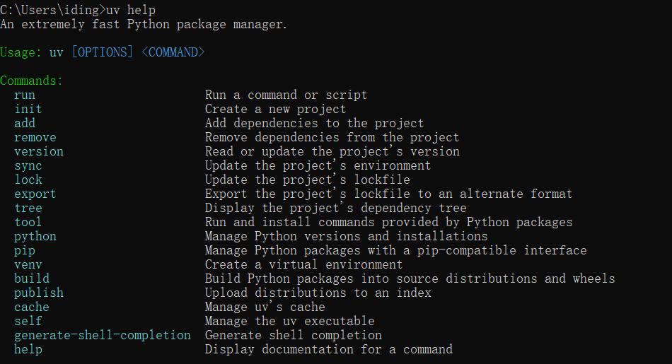
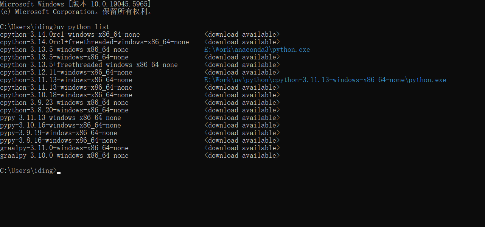

## UV：极速Python包管理器安装配置教程

UV是由Astral公司开发的现代Python包管理器，使用Rust编写，速度比pip快10-100倍。它可以替代pip、pip-tools、pipx、poetry、pyenv等多个工具，提供统一的Python项目管理体验。

### 为什么选择UV？

- **极速性能**：比pip快10-100倍，依赖解析和安装速度显著提升
- **统一工具**：集成包管理、虚拟环境、Python版本管理于一体
- **现代设计**：基于现代Python标准（pyproject.toml），支持PEP 621
- **兼容性强**：完全兼容pip和PyPI生态系统
- **内存安全**：Rust编写，避免内存安全问题

## 1. Windows环境下安装UV

### 方法一：PowerShell安装（推荐）

打开PowerShell，执行以下命令：

```powershell
powershell -c "irm https://astral.sh/uv/install.ps1 | iex"
```

### 方法二：使用winget安装

如果系统已安装winget：

```powershell
winget install --id=astral-sh.uv -e
```

### 方法三：手动下载安装

1. 访问[UV官方Release页面](https://github.com/astral-sh/uv/releases)
2. 下载适合Windows的最新版本
3. 解压到指定目录（如`C:\Tools\uv`）
4. 手动添加到PATH环境变量

## 2. 配置Windows环境变量

### 自动配置检查

安装完成后，UV通常会自动配置环境变量。重新打开命令提示符，验证安装：

```cmd
uv --version
```

您也可以查看UV的完整帮助信息，了解所有可用命令：

```cmd
uv --help
```



### 手动配置环境变量

如果自动配置失败，需要手动设置：

1. 右键点击"此电脑"，选择"属性"
2. 点击"高级系统设置"
3. 在"系统属性"窗口中点击"环境变量"按钮
4. 在"用户变量"中找到或创建`Path`变量
5. 添加UV的安装路径到`Path`中

**常见UV安装路径**：
- PowerShell安装：`%USERPROFILE%\.local\bin`
- winget安装：`%LOCALAPPDATA%\Microsoft\WinGet\Packages\astral-sh.uv_Microsoft.Winget.Source_8wekyb3d8bbwe`


### UV专用环境变量配置

为了更好地管理UV和优化使用体验，建议配置以下6个环境变量：

| 环境变量 | 说明 | 推荐配置值 |
|---------|------|-----------|
| `UV_CACHE_DIR` | UV缓存目录 | `E:\Work\uv\cache` |
| `UV_DEFAULT_INDEX` | 默认包索引源 | `https://mirrors.tuna.tsinghua.edu.cn/pypi/web/simple` |
| `UV_PYTHON_BIN_DIR` | Python可执行文件目录 | `E:\Work\uv\pythonbin` |
| `UV_PYTHON_INSTALL_DIR` | Python安装目录 | `E:\Work\uv\python` |
| `UV_TOOL_BIN_DIR` | 工具二进制文件目录 | `E:\Work\uv\toolbin` |
| `UV_TOOL_DIR` | 工具安装目录 | `E:\Work\uv\tool` |

**配置说明**：
- **UV_CACHE_DIR**：设置UV的缓存目录，避免占用系统盘空间
- **UV_DEFAULT_INDEX**：使用清华镜像源，提高国内下载速度
- **UV_PYTHON_BIN_DIR**：指定Python可执行文件的存放目录
- **UV_PYTHON_INSTALL_DIR**：指定Python版本的安装位置
- **UV_TOOL_BIN_DIR**：设置工具可执行文件的存放目录
- **UV_TOOL_DIR**：设置工具的安装目录


## 3. 更新UV

保持UV为最新版本：

```bash
uv self update
```

## 4. 基础使用

### 4.1 创建新项目

```bash
# 创建新项目
uv init my-project
cd my-project

# 创建指定Python版本的项目
uv init my-project --python 3.12
```

### 4.2 虚拟环境管理

```bash
# 创建虚拟环境
uv venv

# 创建指定Python版本的虚拟环境
uv venv --python 3.12

# 激活虚拟环境（Windows）
.venv\Scripts\activate

# 激活虚拟环境（PowerShell）
.venv\Scripts\Activate.ps1

# 退出虚拟环境
deactivate
```

### 4.3 运行Python代码

UV可以自动管理虚拟环境并运行代码：

```bash
# 运行Python文件（自动管理依赖）
uv run main.py

# 运行模块
uv run -m pytest

# 一次性运行脚本
uv run --with requests -- python -c "import requests; print(requests.get('https://httpbin.org/json').json())"
```

## 5. 包管理

### 5.1 添加依赖

```bash
# 添加包
uv add requests

# 添加开发依赖
uv add --dev pytest black

# 添加指定版本
uv add "django>=4.0,<5.0"

# 从特定索引安装
uv add torch --index-url https://download.pytorch.org/whl/cu118
```

### 5.2 管理依赖

```bash
# 安装所有依赖
uv sync

# 更新依赖
uv lock --upgrade

# 移除包
uv remove requests

# 显示已安装包
uv pip list

# 显示包信息
uv pip show requests
```

### 5.3 导出requirements.txt

```bash
# 导出requirements.txt
uv pip compile pyproject.toml -o requirements.txt

# 导出完整依赖（包括开发依赖）
uv export --format requirements-txt --all-extras --dev > requirements.txt
```

## 6. Python版本管理

### 6.1 安装Python版本

```bash
# 列出可用Python版本
uv python list

# 安装Python版本
uv python install 3.12

# 安装多个版本
uv python install 3.11 3.12 3.13
```



### 6.2 切换Python版本

```bash
# 为当前项目设置Python版本
echo "3.12" > .python-version

# 或使用命令
uv python pin 3.12
```

## 7. 工具管理（替代pipx）

### 7.1 安装全局工具

```bash
# 安装工具
uv tool install black

# 安装特定版本
uv tool install "black==23.0.0"

# 从Git安装
uv tool install git+https://github.com/psf/black.git
```

### 7.2 管理工具

```bash
# 列出已安装工具
uv tool list

# 升级工具
uv tool upgrade black

# 升级所有工具
uv tool upgrade --all

# 卸载工具
uv tool uninstall black
```

## 8. 脚本运行

UV支持直接运行包含依赖信息的Python脚本：

```python
#!/usr/bin/env -S uv run --script
# /// script
# requires-python = ">=3.12"
# dependencies = [
#     "requests",
#     "beautifulsoup4",
# ]
# ///

import requests
from bs4 import BeautifulSoup

def main():
    response = requests.get("https://httpbin.org/html")
    soup = BeautifulSoup(response.text, 'html.parser')
    print(soup.title.string)

if __name__ == "__main__":
    main()
```

将上述内容保存为`script.py`，然后运行：

```bash
uv run script.py
```

## 9. 项目配置文件

### 9.1 pyproject.toml示例

```toml
[project]
name = "my-project"
version = "0.1.0"
description = "My awesome project"
requires-python = ">=3.12"
dependencies = [
    "requests>=2.25.0",
    "click>=8.0.0",
]

[project.optional-dependencies]
dev = [
    "pytest>=7.0.0",
    "black>=23.0.0",
    "ruff>=0.1.0",
]

[tool.uv]
dev-dependencies = [
    "mypy>=1.0.0",
]

# 配置包索引
[[tool.uv.index]]
name = "pytorch"
url = "https://download.pytorch.org/whl/cu118/"

[tool.uv.workspace]
members = ["packages/*"]
```

## 10. 常用命令速查表

| 命令 | 功能 | 示例 |
|------|------|------|
| `uv init` | 初始化项目 | `uv init my-project` |
| `uv add` | 添加依赖 | `uv add requests` |
| `uv remove` | 移除依赖 | `uv remove requests` |
| `uv sync` | 同步依赖 | `uv sync --dev` |
| `uv run` | 运行命令 | `uv run python main.py` |
| `uv venv` | 创建虚拟环境 | `uv venv --python 3.12` |
| `uv python install` | 安装Python | `uv python install 3.12` |
| `uv tool install` | 安装工具 | `uv tool install black` |
| `uv lock` | 生成锁文件 | `uv lock --upgrade` |
| `uv export` | 导出依赖 | `uv export > requirements.txt` |

## 11. 实际使用案例

### 案例1：快速原型开发

```bash
# 创建临时项目
mkdir temp-project && cd temp-project

# 运行包含依赖的代码
uv run --with pandas --with matplotlib -- python -c "
import pandas as pd
import matplotlib.pyplot as plt

data = pd.DataFrame({'x': [1,2,3,4], 'y': [1,4,2,3]})
plt.plot(data['x'], data['y'])
plt.savefig('plot.png')
print('Plot saved!')
"
```

### 案例2：迁移现有项目

```bash
# 从requirements.txt迁移
uv add -r requirements.txt

# 从setup.py迁移
uv init --lib --name mypackage
# 手动转换setup.py内容到pyproject.toml
```

### 案例3：多Python版本测试

```bash
# 安装多个Python版本
uv python install 3.11 3.12 3.13

# 为不同版本创建环境测试
for version in 3.11 3.12 3.13; do
    uv venv "test-$version" --python "$version"
    uv run --env "test-$version" pytest
done
```

## 12. 故障排除

### 常见问题及解决方案

**问题1：UV命令未找到**
```bash
# 检查PATH环境变量
echo $env:PATH  # PowerShell
echo %PATH%     # CMD

# 重新安装
powershell -c "irm https://astral.sh/uv/install.ps1 | iex"
```

**问题2：权限问题**
```bash
# 以管理员身份运行PowerShell
# 或修改安装目录权限
```

**问题3：网络连接问题**
```bash
# 配置代理
uv --help  # 查看代理配置选项

# 使用镜像源
uv add requests --index-url https://pypi.tuna.tsinghua.edu.cn/simple/
```

**问题4：缓存问题**
```bash
# 清理缓存
uv cache clean

# 查看缓存信息
uv cache dir
```

## 13. 最佳实践

1. **项目结构**：使用`uv init`创建标准项目结构
2. **依赖管理**：定期运行`uv lock --upgrade`更新锁文件
3. **版本固定**：在生产环境使用具体版本号
4. **环境隔离**：每个项目使用独立虚拟环境
5. **工具统一**：用UV替代pip、pipx、poetry等工具
6. **脚本编写**：利用内联脚本元数据功能
7. **CI/CD**：在持续集成中使用`uv sync --frozen`

通过本教程，您已经掌握了UV的完整使用方法。UV作为新一代Python包管理器，将显著提升您的开发效率和体验！ 
