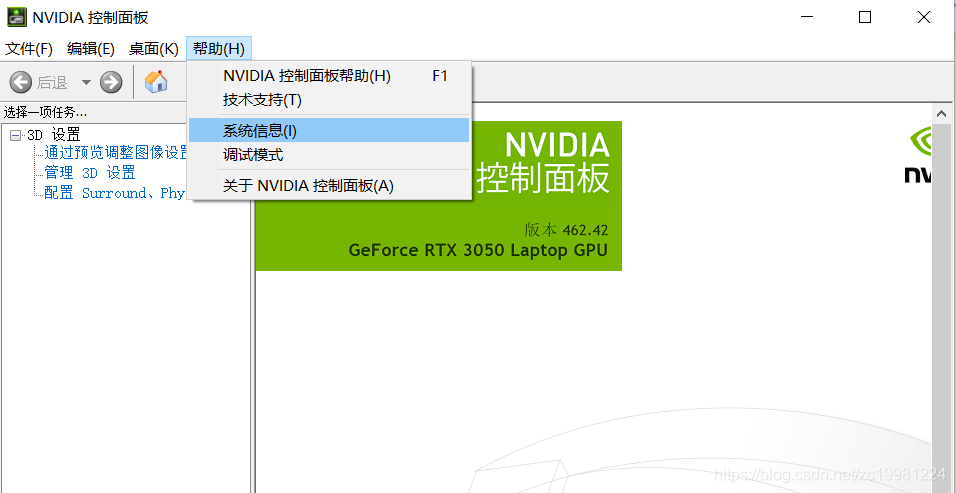
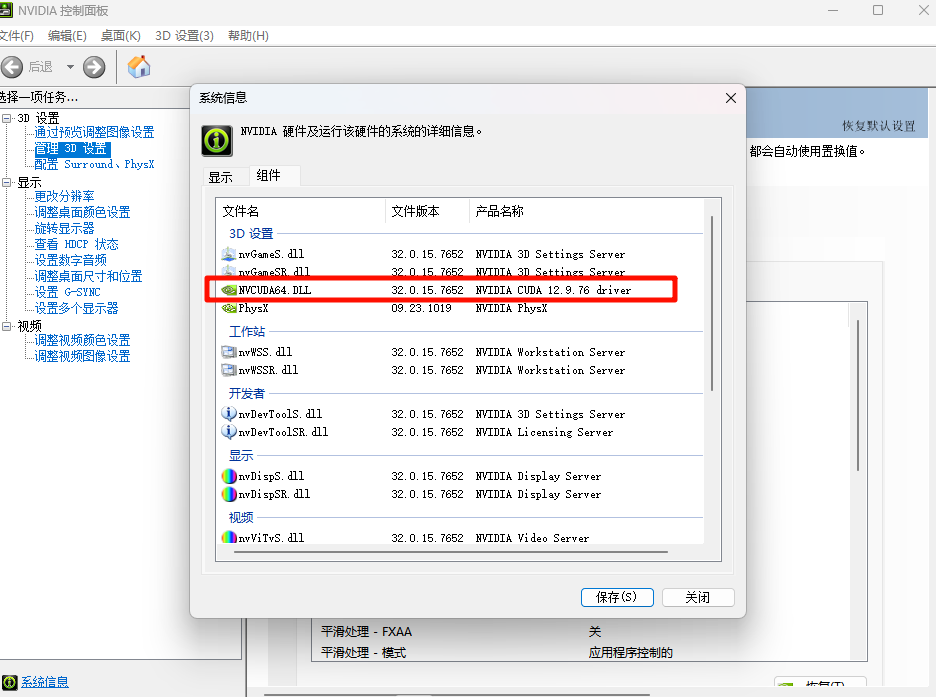
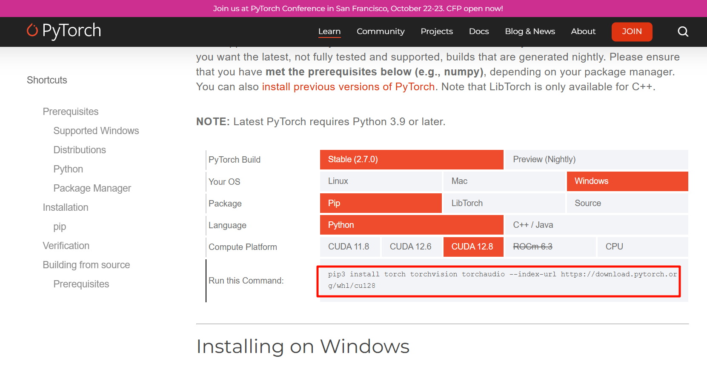
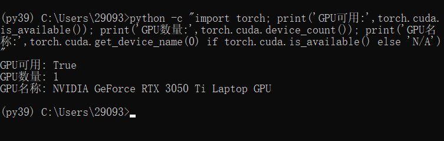

# NVIDIA CUDA安装教程 - GPU深度学习环境配置指南

CUDA（Compute Unified Device Architecture）是NVIDIA推出的并行计算平台和编程模型，是进行深度学习和GPU加速计算的必备环境。本文将详细介绍如何正确安装与您显卡兼容的CUDA版本。

## 1. 确认适配的CUDA版本

在安装CUDA之前，我们需要先确认您的NVIDIA显卡支持哪个版本的CUDA。

### 1.1 查看NVIDIA系统信息

首先打开NVIDIA控制面板，点击界面右下角的"帮助"菜单，然后选择"系统信息"选项。



在系统信息窗口中，您可以查看到您的显卡型号以及支持的CUDA版本。如图所示，此系统适配的CUDA版本是12.9。



## 2. 选择合适的PyTorch版本

根据您的CUDA版本，您需要安装相应版本的PyTorch。

### 2.1 访问PyTorch官网

打开PyTorch官网：https://pytorch.org/get-started/locally/

根据您的CUDA版本，选择适合的PyTorch安装命令。如下图所示，务必选择与您的CUDA版本匹配的选项（本例中应选择CUDA 12.8）。

复制对应的命令 然后到 python环境中执行下载命令 耐心等待下载完成



> **注意**：如果您选择了不匹配的CUDA版本（如选择CUDA 11.8而您的显卡支持CUDA 12.8），可能会导致在深度学习训练时出现不兼容问题。这是一个非常常见的血泪教训。

## 3. 验证PyTorch安装

安装完成后，您可以通过以下Python代码来验证PyTorch是否成功安装并能正确识别您的GPU：

```python
python -c "import torch; print('GPU可用:',torch.cuda.is_available()); print('GPU数量:',torch.cuda.device_count()); print('GPU名称:',torch.cuda.get_device_name(0) if torch.cuda.is_available() else 'N/A')"
```

执行上述命令后，您应该能看到类似以下的输出：



如果`GPU可用`显示为`True`，则表示您的PyTorch已成功安装且能正确识别GPU。如果显示为`False`，请检查您安装的CUDA版本是否与您的显卡兼容，以及PyTorch版本是否与CUDA版本匹配。

正确安装CUDA是进行GPU加速深度学习的重要前提。确保CUDA版本与您的显卡和深度学习框架版本匹配，可以避免很多不必要的兼容性问题，提高您的开发和训练效率。
